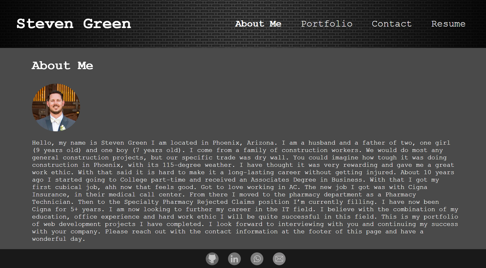
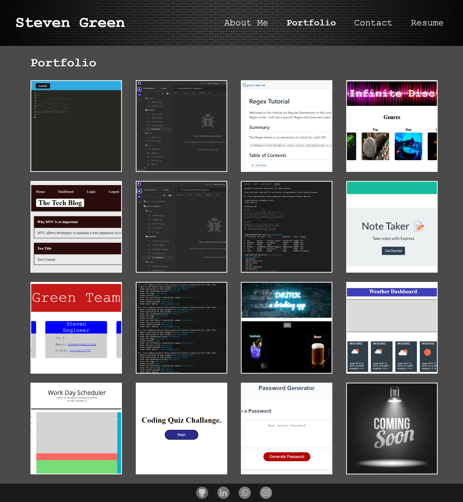
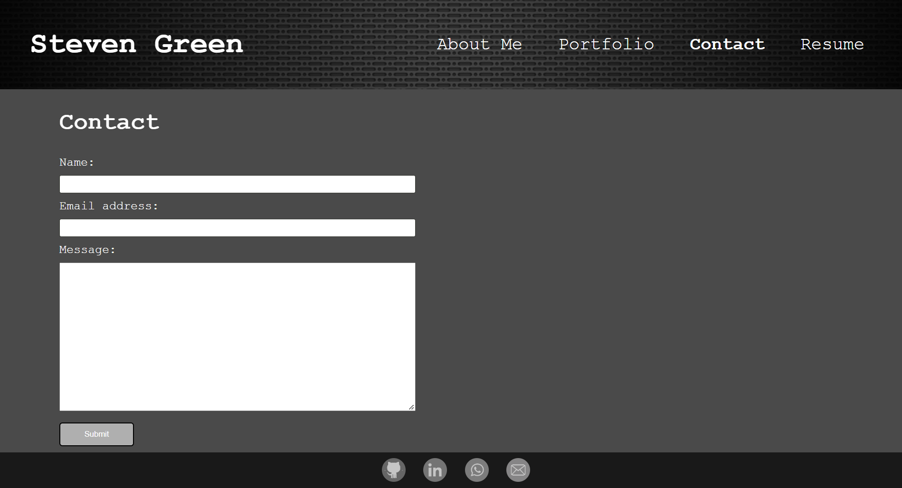
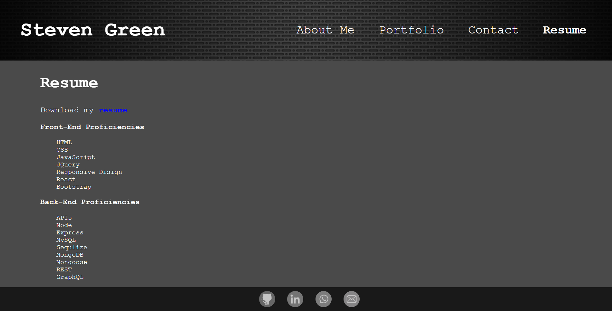

# green-portfolio

## Description
This project is to create a personal portfolio using React. This portfolio will have navigation links that with route people to the about-me, portfolio, contact, and resume sections. All of the content for each section is broken up in to specific components. The about-me page with show a recent image of me and a little bit of information about me. The portfolio page shows all of projects I have completed and can be clicked to depoy there specific GitHub. The contact page has a form that can filled out to contact me with a message and if any input is missing or incorrect a message will display at the bottom of the form. The resume page will show the main front-end/back-end proficiencies and has a link to download a resume. There is also a footer bar at the bottom of each page that will link to my GitHub, LinkedIn, Phone Number, and Email.

## Table of contents
- [Mock-up](#Mock-up)
- [Installation](#Installation)
- [Usage](#Usage)
- [Contribution](#Contributing)
- [Questions](#Questions)
- [Diployment Links](#Questions)
## Mock-up

About Me

Portfolio

Contact

Resume

## Installation
react

react-bootstrap

react-dom

react-scripts

axios

gh-pages

## Usage
npm install

npm run deploy - (deploy github)

npm start - (deploy local host)

## Contributing
Steven Green

## Questions
GitHub Username: [mrgreen12375](https://github.com/mrgreen12375)

Email Address: [ste2144105@gmail.com](ste2144105@gmail.com)
## Deployment Links
Deploy Portfolio: https://mrgreen12375.github.io/green-portfolio/

GitHub Repo: https://github.com/mrgreen12375/green-portfolio